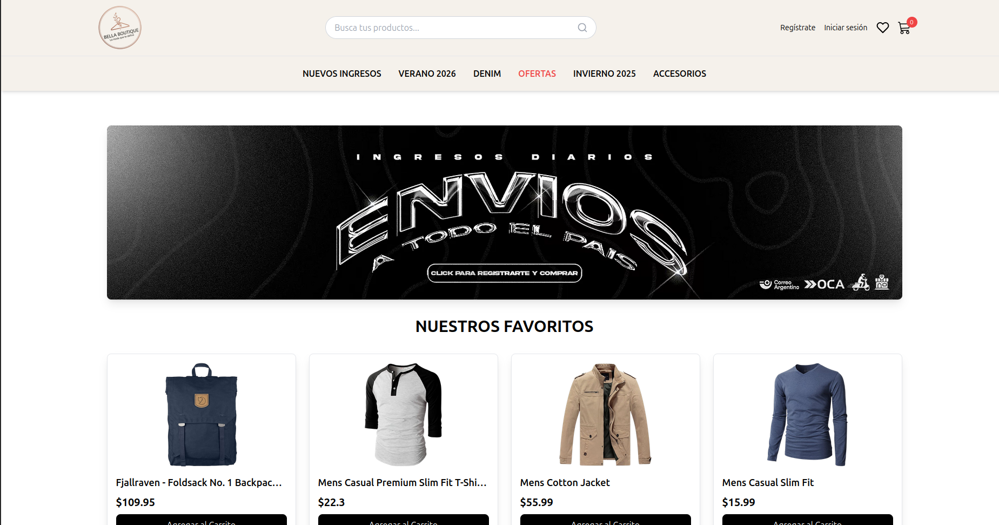

<p align="center">
  
</p>

<h1 align="center">Bella Boutique</h1>

<p align="center">
  Una aplicación front-end de eCommerce moderna y elegante, construida con React, Vite y Tailwind CSS.
  <br />
  Este proyecto simula una experiencia de compra completa, con un diseño inspirado en tiendas de moda líderes.
</p>

---

## Captura de Pantalla



---

## Características Principales

- **Catálogo de Productos Dinámico**: Carga de productos desde múltiples APIs externas (MockAPI + Fake Store API)
- **Búsqueda y Filtrado Avanzado**: 
  - Búsqueda en tiempo real con sincronización entre navbar y páginas
  - Filtros por categoría con interfaz intuitiva
  - Paginación optimizada para grandes catálogos
- **Gestión de Estado Moderna**: 
  - Context API con optimizaciones de rendimiento (useMemo, useCallback)
  - Gestión global de carrito y autenticación
  - Prevención de re-renders innecesarios
- **Carrito de Compras Completo**:
  - Añadir/eliminar productos
  - Actualizar cantidades en tiempo real
  - Cálculo automático de subtotal y total
  - Persistencia con localStorage
- **Navegación Avanzada**:
  - React Router v7 con lazy loading
  - Rutas dinámicas para detalles de productos
  - Mega menús complejos inspirados en tiendas profesionales
  - Rutas protegidas con autenticación simulada
- **Panel de Administración**:
  - CRUD completo de productos
  - Gestión visual con confirmaciones
  - Integración con MockAPI para persistencia
- **Diseño Profesional y Responsivo**:
  - Estilizado con Tailwind CSS y Styled Components
  - Adaptable a móviles, tablets y escritorio
  - Optimización de imágenes con lazy loading
  - Componentes reutilizables y accesibles
- **Optimizaciones de Rendimiento**:
  - Code splitting automático
  - Lazy loading de componentes
  - Minificación y compresión de assets
  - Eliminación de console.log en producción
- **SEO Optimizado**:
  - Meta tags dinámicos con React Helmet
  - Open Graph para redes sociales
  - Descripciones únicas por página

---

## Tecnologías Utilizadas

### Core
- **[React 19.1](https://reactjs.org/)** - Librería de UI
- **[Vite 7.1](https://vitejs.dev/)** - Build tool de próxima generación
- **[React Router DOM 7.9](https://reactrouter.com/)** - Enrutamiento

### Estilos
- **[Tailwind CSS 3.4](https://tailwindcss.com/)** - Framework de CSS utility-first
- **[Bootstrap 5.3](https://getbootstrap.com/)** - Componentes y grid system
- **[Styled Components 6.1](https://styled-components.com/)** - CSS-in-JS

### UI/UX
- **[React Icons 5.5](https://react-icons.github.io/)** - Iconografía
- **[React Toastify 11.0](https://fkhadra.github.io/react-toastify/)** - Notificaciones
- **[React Helmet Async 2.0](https://github.com/staylor/react-helmet-async)** - Gestión de meta tags

### APIs
- **[MockAPI](https://mockapi.io/)** - API REST simulada para productos personalizados
- **[Fake Store API](https://fakestoreapi.com/)** - Datos de productos de demostración

---

## Cómo Empezar

### **Requisitos Previos**

- [Node.js](https://nodejs.org/) (versión 16 o superior)
- [npm](https://www.npmjs.com/) o [yarn](https://yarnpkg.com/)
- Un navegador web moderno

### **Instalación**

1. **Clona el repositorio:**
   ```bash
   git clone https://github.com/dgimenezdeveloper/bellaBoutique.git
   cd bella-boutique
   ```

2. **Instala las dependencias:**
   ```bash
   npm install
   ```

3. **Configura las variables de entorno:**
   
   Copia el archivo de ejemplo:
   ```bash
   cp .env.example .env
   ```
   
   El archivo `.env` ya contiene las URLs predeterminadas:
   ```env
   VITE_MOCKAPI_BASE_URL=https://692f619991e00bafccd76fb9.mockapi.io
   VITE_FAKESTORE_API_URL=https://fakestoreapi.com/products
   VITE_APP_NAME=Bella Boutique
   VITE_APP_DESCRIPTION=Una aplicación de eCommerce moderna para moda
   ```

4. **Inicia el servidor de desarrollo:**
   ```bash
   npm run dev
   ```

5. **Abre tu navegador:**
   
   La aplicación estará disponible en `http://localhost:5173`

---

## Scripts Disponibles

```bash
# Desarrollo
npm run dev          # Inicia el servidor de desarrollo

# Producción
npm run build        # Genera el build de producción en /dist
npm run preview      # Previsualiza el build de producción localmente

# Linting
npm run lint         # Ejecuta ESLint para encontrar problemas en el código

# Utilidades
npm run populate     # Puebla MockAPI con productos de ejemplo (requiere Node.js)
```

---

## 🗂️ Estructura del Proyecto

```
bella-boutique/
├── public/                  # Archivos estáticos
│   └── images/             # Imágenes públicas
├── scripts/                # Scripts de utilidad
│   └── populate-mockapi.js # Script para poblar MockAPI
├── src/
│   ├── assets/            # Recursos de la aplicación
│   ├── components/        # Componentes reutilizables
│   │   ├── Cart.jsx              # Componente de carrito
│   │   ├── CategoryFilter.jsx    # Filtro de categorías
│   │   ├── ConfirmModal.jsx      # Modal de confirmación
│   │   ├── MegaMenu.jsx          # Menú desplegable complejo
│   │   ├── Navbar.jsx            # Barra de navegación principal
│   │   ├── NavbarSearch.jsx      # Barra de búsqueda del navbar
│   │   ├── Pagination.jsx        # Componente de paginación
│   │   ├── ProductCard.jsx       # Tarjeta de producto
│   │   ├── ProductForm.jsx       # Formulario de productos (admin)
│   │   ├── ProtectedRoute.jsx    # Rutas protegidas
│   │   ├── SearchBar.jsx         # Barra de búsqueda
│   │   └── SocialBar.jsx         # Barra de redes sociales
│   ├── context/           # Contextos de React
│   │   ├── AuthContext.jsx       # Contexto de autenticación
│   │   ├── CartContext.jsx       # Contexto del carrito
│   │   └── ProductContext.jsx    # Contexto de productos
│   ├── layouts/           # Layouts principales
│   │   └── MainLayout.jsx        # Layout principal de la app
│   ├── pages/             # Páginas de la aplicación
│   │   ├── HomePage.jsx           # Página de inicio
│   │   ├── ProductsPage.jsx       # Catálogo de productos
│   │   ├── ProductDetailPage.jsx  # Detalle de producto
│   │   ├── CartPage.jsx           # Página del carrito
│   │   ├── LoginPage.jsx          # Página de login
│   │   ├── ProfilePage.jsx        # Perfil de usuario
│   │   └── AdminProductsPage.jsx  # Panel de administración
│   ├── App.jsx            # Componente principal
│   ├── main.jsx           # Punto de entrada
│   ├── index.css          # Estilos globales (Tailwind)
│   └── App.css            # Estilos del componente App
├── .env                   # Variables de entorno (no commitear)
├── .env.example           # Ejemplo de variables de entorno
├── eslint.config.js       # Configuración de ESLint
├── tailwind.config.js     # Configuración de Tailwind
├── vite.config.js         # Configuración de Vite (optimizada)
└── package.json           # Dependencias y scripts
```

---

## Autenticación Simulada

Para propósitos de demostración, la aplicación usa autenticación simulada:

- **Usuario**: Cualquier nombre de usuario
- **Contraseña**: `1234`

Las rutas protegidas incluyen:
- `/cart` - Carrito de compras
- `/profile` - Perfil de usuario
- `/admin/products` - Panel de administración

---

## Características de UX/UI

### Búsqueda Inteligente
- Búsqueda en tiempo real sin recargar la página
- Sincronización entre barra de búsqueda del navbar y página de productos
- Búsqueda por título y categoría de productos
- Feedback visual del número de resultados

### Filtros Avanzados
- Filtros por categoría con botones visuales
- Paginación dinámica que se adapta a los filtros
- Indicadores visuales del filtro activo

### Carrito de Compras
- Actualización en tiempo real del contador
- Gestión de cantidades con validación
- Cálculo automático de totales
- Notificaciones toast al agregar productos

### Responsive Design
- Mobile-first approach
- Breakpoints optimizados: 640px, 768px, 1024px, 1280px
- Imágenes adaptativas con lazy loading
- Menús hamburguesa en dispositivos móviles

---

## Despliegue

### Opción 1: Vercel (Recomendado)

1. Instala Vercel CLI:
   ```bash
   npm i -g vercel
   ```

2. Despliega:
   ```bash
   vercel
   ```

3. Configura las variables de entorno en el dashboard de Vercel

### Opción 2: Netlify

1. Construye el proyecto:
   ```bash
   npm run build
   ```

2. Despliega la carpeta `dist`:
   ```bash
   npm i -g netlify-cli
   netlify deploy --prod --dir=dist
   ```

### Opción 3: GitHub Pages

1. Instala gh-pages:
   ```bash
   npm install --save-dev gh-pages
   ```

2. Agrega estos scripts a `package.json`:
   ```json
   "predeploy": "npm run build",
   "deploy": "gh-pages -d dist"
   ```

3. Actualiza `vite.config.js`:
   ```js
   base: '/nombre-repositorio/'
   ```

4. Despliega:
   ```bash
   npm run deploy
   ```

---

## Optimizaciones de Rendimiento

### Code Splitting
- Lazy loading de páginas con React.lazy()
- Chunks separados para vendors principales
- Suspense boundaries para mejor UX

### Gestión de Estado
- useCallback para funciones estables
- useMemo para cálculos costosos
- Context optimizado para prevenir re-renders

### Build Optimizado
- Minificación con Terser
- Eliminación de console.log en producción
- Tree shaking automático
- Compresión de assets

---

## Problemas Conocidos

- La autenticación es simulada y no persistente entre sesiones
- MockAPI tiene límites de rate limiting en plan gratuito
- Algunos productos de Fake Store API no tienen todas las propiedades

---

## Contribuciones

Las contribuciones son bienvenidas. Por favor:

1. Fork el proyecto
2. Crea una rama para tu feature (`git checkout -b feature/AmazingFeature`)
3. Commit tus cambios (`git commit -m 'Add some AmazingFeature'`)
4. Push a la rama (`git push origin feature/AmazingFeature`)
5. Abre un Pull Request

---

## Licencia

Este proyecto es de código abierto y está disponible bajo la licencia MIT.

---

## Autor

**Daniel Giménez**
- GitHub: [@dgimenezdeveloper](https://github.com/dgimenezdeveloper)
- Repositorio: [bellaBoutique](https://github.com/dgimenezdeveloper/bellaBoutique)

---

## Agradecimientos

- [Fake Store API](https://fakestoreapi.com/) por proporcionar datos de productos de prueba
- [MockAPI](https://mockapi.io/) por facilitar el desarrollo con una API REST simulada
- La comunidad de React por las excelentes herramientas y documentación

---

<p align="center">Hecho con ❤️ por Daseg</p>